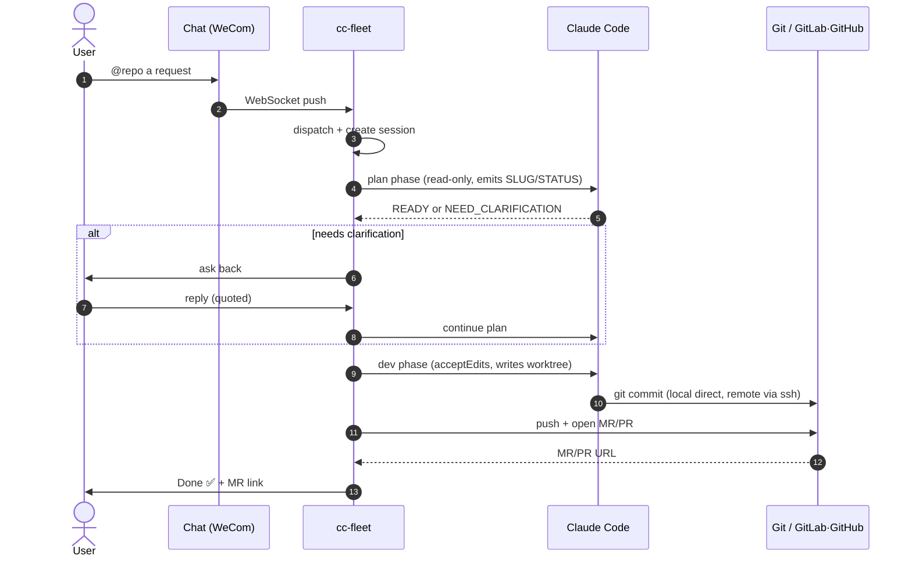

# cc-fleet

**English** | [中文](./README.md)

**A fleet of Claude Code agents, dispatched from chat — plan, branch, deliver in parallel.**

[](./LICENSE)
[](https://www.python.org/downloads/)
[](#roadmap--known-limitations)

---

cc-fleet turns your team chat (WeChat Work and personal WeChat) into an **intake desk for engineering work**: @-mention the bot with a request, and cc-fleet spins up a Claude Code agent that first clarifies with you and delivers a **plan**, then — once you confirm — develops in an isolated `git worktree`, commits, pushes, and **opens a fully-described MR/PR automatically**. Many repos and many tasks run concurrently without stepping on each other; your main working tree stays clean.

> ⚠️ **Security boundary — read this first.** cc-fleet is built for **internal, trusted environments**. Its guardrails are *soft*: a `PreToolUse` hook blocks force-push / out-of-tree writes / sensitive-path access, but a prompt-injected agent can still bypass them via shell-string obfuscation. **Do not expose it to the public internet.** See [Security](#security).

## What it is NOT

cc-fleet is **not just another "bridge Claude Code into IM" tool.** If all you want is to drive Claude Code remotely from chat, [cc-connect](https://github.com/chenhg5/cc-connect) / [cc-im](https://github.com/congqiu/cc-im) / [cc2im](https://github.com/roxorlt/cc2im) / GitHub Copilot CLI's `/fleet` are lighter choices — they hand you a remote terminal.

cc-fleet takes a narrower path: **request → plan / clarify → isolated worktree → automatic MR**. It automates the *whole delivery chain* and puts hard quality constraints on every MR it opens. You give it a *requirement*; it gives you a *reviewable MR*.

## 30-second overview



The full state machine and the `apply_followup` recovery table live in [docs/state-machine.md](./docs/state-machine.md) (Chinese).

## Scope & status

- **Git hosting**: repos whose origin is **GitLab** (MR via `git push -o merge_request.create`) or **GitHub** (PR via REST API; set `GITHUB_TOKEN` / `GH_TOKEN` in `.env`). Platform is auto-detected from the origin URL. Gitee / Bitbucket are not adapted yet — PRs welcome.
- **Chat platforms**: WeChat Work smart bot (`platform: wecom`) and personal WeChat (`platform: wechat`, Tencent's official ilink ClawBot protocol, QR-code login). Personal WeChat is constrained by the platform: **1:1 chat only**, messages render as plain text (no markdown), and the bot cannot send files to users. Slack / Lark / Discord adapters are welcome as PRs.
- **Dev environment**: thoroughly tested on macOS only; a Linux controller should work but is not systematically verified.
- **Dependencies**: Python ≥ 3.10, chat-platform credentials, and the `claude` CLI (Claude Code) on `PATH`.

## Core features

- **Conversational routing**: explicit `@<repo-alias>` + keyword fallback + quoted-reply reverse-resolution of `[session: <slug>]`; concurrent sessions never cross-talk.
- **Isolated development**: one `git worktree` + branch per session; the main tree stays clean. A full state machine covers plan / clarify / dev / open-MR, and finished or failed sessions can be re-woken by quoting a reply.
- **Persistence & visibility**: SQLite + per-session `stream.jsonl` (raw Claude SDK stream); a built-in **read-only local HTTP panel** shows live state, chat history, and the event stream.
- **Optional independent Reviewer** (per repo): inserts a review checkpoint after plan and after dev, run by a *second* agent distinct from the Coder — see [docs/reviewer.md](./docs/reviewer.md) (Chinese).
- **Hard MR-quality constraints**: imperative title, commit-type prefix, and a six-section description template (background / original request / summary / tests & verification / docs sync / risk & rollback), with a git-log fallback if the agent omits them.
- **Soft guardrails** (`PreToolUse` hook): block `git push --force` and variants, out-of-tree writes, and access to sensitive paths like `~/.ssh` / `/etc/passwd`.
- **Simple CLI**: `sessions list / cancel / logs`, and `wechat-login` (QR login to obtain a personal-WeChat `bot_token`).

## Quickstart (5 minutes)

```bash
# 1. Install
python3 -m venv .venv
.venv/bin/python -m pip install -e ".[dev]"

# 2. Configure (minimal)
cp config.example.yaml config.yaml
cp .env.example .env
# Edit .env: WECOM_BOT_ID / WECOM_BOT_SECRET (GitHub repos also need GITHUB_TOKEN)
# Edit config.yaml: point repos[].path at an existing local git repo

# 3. Run
.venv/bin/cc-fleet --config config.yaml run
```

For personal WeChat instead of WeChat Work, set `platform: wechat`, fill the `wechat:` block, and grab a token via QR login first:

```bash
.venv/bin/cc-fleet wechat-login   # prints a QR link; scan with the WeChat account to bind
# put the printed bot_token into WECHAT_BOT_TOKEN in .env, then `cc-fleet ... run`
```

git push uses SSH by default (load your key into `ssh-agent` on macOS). MR/PR creation needs **no** `glab` / `gh` CLI: GitLab uses push options; GitHub uses the REST API with `GITHUB_TOKEN` / `GH_TOKEN` (classic PAT with `repo`, or fine-grained PAT granting Pull requests read/write). For GitHub Enterprise on a custom domain, set `platform: github` explicitly in the repo config.

## Using it in chat

- **New request**: `@<repo-alias> ...your request...` (the `@` prefix is optional if `keywords` match).
- Every bot reply ends with a `[session: <slug>]` line — the reverse identifier. **Quote the message containing that line** to make your reply land in the same session.
- **Clarify loop**: when the plan phase asks a question, quote that message to answer.
- **Done / failed / timeout**: quoting the receipt re-wakes the session. Done sessions default to "append to dev"; failed/timeout resume by `failed_phase`. **`cancelled` is not resumable** — quoting it is treated as a brand-new request.

### Control-panel commands

| Command | Purpose |
|---|---|
| `/list` | List working / awaiting sessions active in the last 7 days; `/list all` lists every state |
| `/cancel <slug>` | Cancel a session (or quote a session message and send `/cancel` with no arg) |
| `/resume <slug>` | Explicitly revive a "working" orphan session (left after the controller was killed) |
| `/plan <slug>` | Show the session's current `plan.md` in full |
| `/repos` | List configured repos with their `aliases` / `keywords` / `mode` |
| `/chat <msg>` | Start a multi-turn free-form conversation with the agent (writable, isolated in a dedicated worktree); `@<repo> /chat <msg>` binds a repo, omit `@repo` to use a fallback dir (with a warning). See "Free-form chat" below |
| `/dev [notes]` | **Quote** a `/chat` message to turn that discussion into a real delivery task (reuses the chat context, runs the full plan→dev→MR pipeline). See "Hand a chat off to development" below |
| `/help` | Help text |

Concurrency is capped by `limits.max_concurrent_sessions` (default 4); excess requests are queued.

You can also override the Reviewer per request: add `[review]` (force on) or `[review:off]` (force off); the marker is stripped from the text sent to the agent.

### Free-form chat (`/chat`)

`/chat` opens a conversation channel that is **separate from the delivery pipeline**: the agent becomes a multi-turn chat window over WeChat — cc-fleet just pipes I/O, forwarding the agent's output to you and your next message back to the same agent session.

```
@my-repo /chat where is the entry point of this project?
```

- **Repo-bound + isolated**: `@<repo> /chat` creates a dedicated worktree at `<repo>-worktrees/<slug>` (branch `chat/<slug>`); the agent has full tools, is **writable and can run commands**, but is confined to that worktree by the same PreToolUse guardrails used for development.
- **Fallback without `@repo`**: a bare `/chat <msg>` runs in `chat.default_cwd` (or the user's home dir if unset), **without** a worktree, and replies with a warning naming the fallback path. Prefer binding a repo.
- **Multi-turn**: every reply ends with `[session: <slug>]`; **quote that message** and add text to continue the next turn (same quote-reply mechanism as delivery sessions); context continuity is via `--resume`.
- **Turn-by-turn**: you send one message, the agent finishes that turn, and the full output is auto-split into ~4000-char chunks.
- **Concurrency**: chat uses its own pool `chat.max_concurrent` (default 4) and does **not** consume `limits.max_concurrent_sessions`, so long chats never starve the plan/dev pipeline.
- **End it**: `/cancel <chat-slug>`, or quote a chat message and send `/cancel`; once the requirement is nailed down you can also `/dev` it into real development (see below).

#### Hand a chat off to development (`/dev`)

When a requirement takes several rounds to pin down, discuss it in `/chat` first, then **quote** any bot message from that chat and send `/dev [notes]` to turn the discussion straight into a real delivery task:

```
/dev also add unit tests please      # send this while quoting a chat reply
```

- **Zero context loss**: the new delivery session **reuses the same agent session** (`--resume`), so the whole discussion carries into planning with no need to restate it. The first plan turn is told to plan *from the agreed conclusions* rather than re-exploring.
- **Full pipeline**: it starts at **planning**, producing `plan.md` (optionally plan review), then dev → (optional code review) → MR, exactly like a normal request.
- **Repo inherited from the chat**: a task handed off from `@<repo> /chat` develops in a clean worktree of that repo (`<repo>-worktrees/<slug>`, branch `claude/<slug>`); context rides on `--resume`, not on the chat worktree's scratch changes. A **bare `/chat` (no repo) cannot be `/dev`'d** — re-run it as `@<repo> /chat`, or just `@<repo> <request>`.
- **Chat archived**: after handoff the original chat is archived (no more replies); follow up by quoting the **delivery task's** messages instead. A chat can be handed off only once.
- **Preconditions**: the chat must have replied at least once (agent session established) and not be mid-reply.

Config lives under the `chat:` block in `config.yaml`:

```yaml
chat:
  default_cwd: ~/cc-fleet-chat   # fallback cwd when @repo is omitted; home dir if unset
  max_concurrent: 4              # dedicated chat concurrency
  turn_timeout_sec: 3600         # per-turn agent subprocess timeout (seconds)
```

## Optional Reviewer

By default a single agent (Coder) both plans and codes. For important repos, enable a **separate Reviewer agent** that critiques at the plan and code checkpoints:

```yaml
repos:
  - name: my-repo
    path: ~/workspace/my-repo
    default_branch: main
    reviewer:
      enabled: true
      max_rounds: 1   # cap on review→revise rounds (default 1; 0 disables)
```

Rationale, independent sessions, the four verdict paths, and `[review]` inline-marker precedence are in [docs/reviewer.md](./docs/reviewer.md) (Chinese).

## Remote development repos (`mode=remote`)

Some projects don't live locally: locally there is only a "launcher shell" directory (with `CLAUDE.md` / rules), while the real code and worktree live on a remote dev box that Claude Code drives over SSH:

```yaml
repos:
  - name: my-project
    path: ~/my-project              # local shell dir; need not be a git repo
    default_branch: main
    mode: remote
    remote_ssh_alias: dev01.example.com
    remote_repo_path: /home/youruser/my-project
    remote_worktree_root: /home/youruser/my-project-worktrees
```

Full lifecycle differences (defer-push / publish phase / local-vs-remote table) are in [docs/remote-mode.md](./docs/remote-mode.md) (Chinese).

## Local HTTP panel

The main process also serves a read-only aiohttp panel at `http://127.0.0.1:8787/` by default — open it to see every session's state, user/bot chat history, and the Claude SDK event stream.

- Defaults to `enabled: true`, `bind: 127.0.0.1`, **no auth — local process only, do not expose to the public internet.** Adjust via `http.enabled / bind / port`.
- The frontend is a single-file `web/static/index.html` (vanilla JS, 3s polling). The "Plan" modal can switch between `Plan / Plan review / Code review` tabs.

Full API table, SQLite schema, and frontend filter semantics: [docs/architecture.md](./docs/architecture.md) (Chinese).

## Security

> ⚠️ **The current version is for internal, trusted environments. Never expose it to the public internet.** Soft guardrails can only intercept dangerous operations when Claude Code uses standard tools; a prompt-injected agent may still bypass them via shell-string obfuscation. A macOS `sandbox-exec` hard-isolation layer is on the roadmap and required before any external exposure.

Two layers of protection today: (1) the plan phase runs in `plan` permission mode (read-only); (2) the dev phase runs in `acceptEdits` mode plus the `PreToolUse` hook. The hook lives at `src/cc_fleet/security/hooks/pretool_guard.py` (tests in `tests/test_pretool_guard.py`). Full boundary, injection semantics, and an external-deployment checklist: [docs/security.md](./docs/security.md) and [SECURITY.md](./SECURITY.md) (Chinese).

## Roadmap & known limitations

**Not supported yet**: chat platforms beyond WeCom/WeChat (Slack/Lark/Discord); git hosts beyond GitLab/GitHub (Gitee/Bitbucket); systematically verified Linux controller; the soft guardrails are bypassable and **not suitable for public exposure**.

**On the roadmap** (no committed timeline): macOS `sandbox-exec` hard isolation; launchd autostart / Keychain credentials; a write-capable management panel (cancel / requeue / reroute); installing the `PreToolUse` hook on the remote dev box too.

## Docs

Detailed docs are in **Chinese**:

- [docs/architecture.md](./docs/architecture.md) — HTTP API, SQLite schema, frontend
- [docs/state-machine.md](./docs/state-machine.md) — full session state machine
- [docs/reviewer.md](./docs/reviewer.md) — independent Reviewer design
- [docs/remote-mode.md](./docs/remote-mode.md) — `mode=remote` lifecycle
- [docs/security.md](./docs/security.md) / [SECURITY.md](./SECURITY.md) — security boundary & deployment checklist
- [docs/troubleshooting.md](./docs/troubleshooting.md) — troubleshooting by platform / state

## Testing

```bash
.venv/bin/python -m pytest -v
```

## Contributing

Collaboration rules are in [AGENTS.md](./AGENTS.md) (also auto-read by Claude Code, Codex, Cursor, Aider, etc.). Human contributors should read [CONTRIBUTING.md](./CONTRIBUTING.md) first. Vulnerability disclosure & secure-deployment checklist: [SECURITY.md](./SECURITY.md).

## License

[MIT License](./LICENSE)
