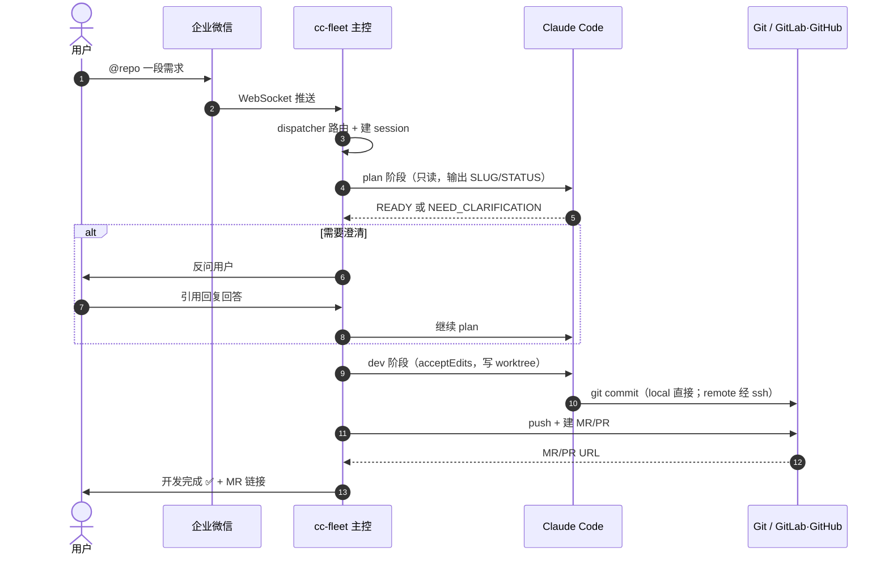
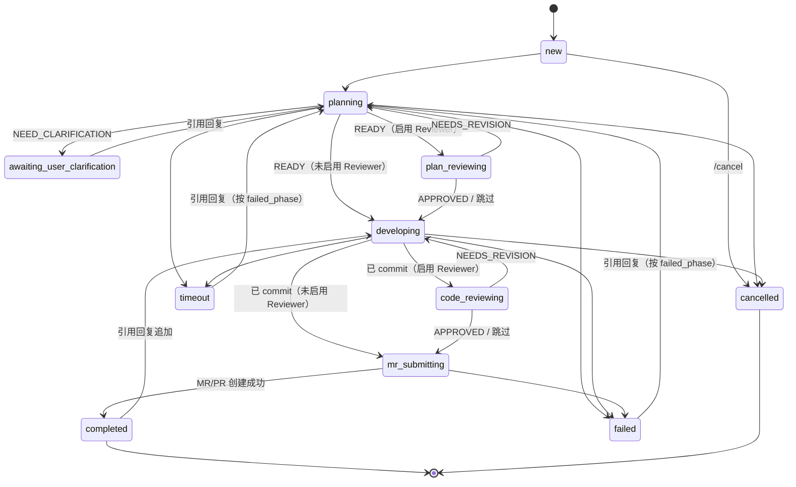

# cc-fleet

[English](./README.en.md) | **中文**

**A fleet of Claude Code agents, dispatched from chat — plan, branch, deliver in parallel.**

**对话驱动的 Claude Code 多项目并发舰队 —— 一句话起需求，并行 plan、开发、提 MR。**

[](./LICENSE)
[](https://www.python.org/downloads/)
[](#路线图与已知限制)

---

cc-fleet 把团队聊天工具（支持企业微信与个人微信）变成"需求受理席"：在群里 @ bot 说一句需求，cc-fleet 启动一个 Claude Code agent，先与你多轮澄清并交付 plan，确认后在独立的 git worktree 里完成开发、commit、push，并自动创建一份带完整元数据的 MR。多项目、多任务并发，互不干扰，主仓库永远干净。

> ⚠️ **安全边界（先看这条）**：cc-fleet 当前为**内部信任环境**设计，护栏是"软"的——`PreToolUse` hook 能拦 force push / 越界写 / 敏感路径，但被 prompt-injection 后仍可经 shell 字符串混淆绕过。**绝不要暴露公网。** 详见[安全护栏](#安全护栏)。

## 30 秒看懂



> 上图是**开发流水线**。默认交互是"先聊后做"：普通消息先进入 `/chat` 只读讨论，聊清楚后引用消息发 `/dev` 才转入上图流程；想跳过讨论直达开发用 `/dev <需求>`。详见「在聊天里使用」。单仓库时发消息无需 `@<repo>`。

## 状态机一览



完整语义、`apply_followup` 恢复表见 [docs/state-machine.md](./docs/state-machine.md)。

## 它不是什么

cc-fleet **不是又一个"把 Claude Code 接到 IM"的桥**。如果你只想在聊天里远程操作 Claude Code，[cc-im](https://github.com/congqiu/cc-im) / [cc-connect](https://github.com/chenhg5/cc-connect) / [cc2im](https://github.com/roxorlt/cc2im) / GitHub Copilot CLI 的 `/fleet` 子命令都是更轻的选择。

cc-fleet 选了一条更窄的路：**对话需求 → plan / 澄清 → worktree 隔离 → 自动 MR** —— 把整条交付链路自动化掉，并对每一份 MR 的质量做硬约束。

## 适用范围与现状

- **代码托管平台**：支持 origin 为 **GitLab**（MR 走 `git push -o merge_request.create`）或 **GitHub**（PR 走 REST API，需在 `.env` 配 `GITHUB_TOKEN` / `GH_TOKEN`）的仓库，平台按 origin URL 自动探测；Gitee、Bitbucket 等尚未适配，欢迎 PR
- **聊天平台**：支持企业微信智能机器人（`platform: wecom`）与个人微信（`platform: wechat`，腾讯官方 ilink ClawBot 协议，扫码登录）。个人微信侧受官方限制：**单聊 1:1**、消息按纯文本渲染（markdown 不解析）、机器人不能发文件给用户；Slack / Lark / Discord 等接入欢迎 PR
- **开发环境**：仅在 macOS 上充分测试；Linux 主控应可工作但未系统验证
- **依赖**：Python ≥ 3.10、聊天平台凭据（企业微信机器人 或 个人微信 ilink `bot_token`）、本机 `claude` CLI（Claude Code）在 PATH 中

## 核心特性

- **对话路由**：单仓库免 @（直接说话即归属唯一仓库）、`@<repo-alias>` 显式路由 + keyword 兜底 + 引用回复反向解析 `[session: <slug>]`；默认"先 `/chat` 只读讨论、引用消息发 `/dev` 转开发"（可配 `default_mode`），多 session 并发不串味
- **可插拔 Agent Runner**：架构把「驱动 coding agent 子进程」抽象成可插拔 runner，编排层工具无关；当前实现 **Claude Code**，Codex / opencode 待接入 —— 设计与扩展思路见 [docs/architecture.md](./docs/architecture.md)
- **隔离开发**：每个 session 一个独立 `git worktree` + 独立分支，主工作树永远干净；session 完整状态机覆盖 plan / 澄清 / dev / 提 MR 全程，失败 / 完成后仍可引用回复唤醒续推
- **持久化与可视化**：SQLite + per-session `stream.jsonl` 全量原文 + 人类可读的 `session.log`（去噪渲染工具输入/返回、阶段流转、失败判决，出问题打开一个文件即可，无需线上复现）；自带本地只读 HTTP 面板，可看实时状态、聊天记录、Claude SDK 事件流
- **可选独立 Reviewer**（按 repo 开启）：在 plan 与开发完成后各插入审查检查点，由独立于 Coder 的第二个 agent 挑剔审查、Coder 据意见完善 —— 详见 [docs/reviewer.md](./docs/reviewer.md)
- **MR 质量硬约束**：标题动宾化、commit type 前缀、描述六小节模板（背景 / 用户原始需求 / 改动概要 / 测试与验证 / 文档与注释同步 / 风险与回滚），缺失自动走 git log 兜底
- **软护栏**（`PreToolUse` hook）：禁止 `git push --force` 及各种变体、禁止工作目录外写、禁止访问 `~/.ssh` / `/etc/passwd` 等敏感路径
- **简单 CLI**：`sessions list / cancel / logs`、`wechat-login`（个人微信扫码取 `bot_token`）

> 多 session 并发已支持（见 `limits.max_concurrent_sessions`）；本地只读 HTTP 面板已就绪（见下文）。
>
> 当前**不包含**：macOS sandbox-exec 硬隔离、launchd 自启、Keychain 凭据、写操作管理面板 —— 见[路线图与已知限制](#路线图与已知限制)。

## Quickstart（5 分钟）

```bash
# 1. 安装
python3 -m venv .venv
.venv/bin/python -m pip install -e ".[dev]"

# 2. 配置（最小可工作）
cp config.example.yaml config.yaml
cp .env.example .env
# 编辑 .env：填 WECOM_BOT_ID / WECOM_BOT_SECRET（GitHub 仓库还需 GITHUB_TOKEN）
# 编辑 config.yaml：把 repos[].path 指向你已有的本地 git 仓库

# 3. 启动
.venv/bin/cc-fleet --config config.yaml run
```

用个人微信而非企业微信时：把 `config.yaml` 的 `platform` 改为 `wechat` 并填好 `wechat:` 段，先扫码取 token——

```bash
.venv/bin/cc-fleet wechat-login        # 终端给出扫码链接（自动尝试打开浏览器），用要绑定的微信扫码确认
# 把打印出的 bot_token 写进 .env 的 WECHAT_BOT_TOKEN，再 cc-fleet ... run
```

后台运行：

```bash
nohup .venv/bin/cc-fleet --config config.yaml run \
  > ~/Library/Logs/cc-fleet/stdout.log 2>&1 &
```

主控被 kill 后，working 状态的 session 会变成"孤儿"，前端 `/list` 仍可见但实际没在跑 —— 用 `/resume <slug>` 显式拉起；awaiting 状态请引用 plan 反问消息回答；终态请引用最近一条 session 消息追加内容唤醒。

git push 默认走 SSH（macOS 请保证 `ssh-agent` 已加载 key）。提 MR/PR 按平台分流，均**无需** `glab` / `gh` CLI：

- **GitLab**（origin 指向 gitlab.com 或自建 GitLab）：MR 走 push option，无需额外凭据
- **GitHub**（origin 指向 github.com 或 GitHub Enterprise）：需在 `.env` 配 `GITHUB_TOKEN` / `GH_TOKEN`（classic PAT 勾 `repo`，或 fine-grained 授予 Pull requests 读写）；GitHub Enterprise 用自有域名时 auto 探测识别不出，需在 repo 配置里显式 `platform: github`

## 在聊天里使用

**默认"先聊后做"**（`default_mode: chat`，可在配置切成 `dev`）：直接发消息就进入多轮**只读讨论**把需求聊清楚，聊明白后**引用**该对话消息发 `/dev` 转成正式开发；想跳过讨论、一句话直达开发就用 `/dev <需求>`。

- **只配了一个仓库时**：发消息**无需 `@<repo>` 前缀**，直接说话即可自动归属唯一仓库——最贴合聊天习惯。配置了多个仓库才需要用 `@<repo>` 指明（或靠 `keywords` 兜底）。
- **默认讨论**：`<需求 / 问题>`（单仓库）或 `@<repo> <需求 / 问题>`（多仓库）→ 进入 `/chat` 只读讨论。
- **直达开发**：`/dev <需求>`（单仓库）或 `@<repo> /dev <需求>`（多仓库）→ 跳过讨论，直接进入 plan→dev→MR 流水线。
- **讨论转开发**：在讨论里聊清楚后，**引用**该对话的机器人消息发 `/dev [补充说明]`。
- 机器人回复末尾附 `[session: <internal-slug> @<repo>]`，可立即引用该消息发 `/cancel` 取消，或追加文字继续；plan 完成后机器人通知会切到可读 display_slug
- **澄清回路**：plan 阶段反问时引用该条消息回复即可继续
- **完成 / 失败 / 超时**：机器人回执仍带 `[session: <slug>]`，**引用回复**会唤醒原 session 继续推进
  - 已完成 session 默认按"追加 dev"处理（不重做 plan），followup 文本以"追加反馈"形式注入 dev prompt 给 claude
  - 失败 / 超时按 `failed_phase` 决定是从 plan 重评估、还是直接在 worktree 上继续开发
  - **`cancelled` 不可恢复**：用户主动 `/cancel` 之后，再引用该 session 的回执回复会被当作"发新需求"处理

每条机器人消息末尾都会带 `[session: <slug>]` 行 —— 这是反向标识符，用户**必须引用包含这一行的消息**才能让回复落到同一个 session。

### 聊天控制面指令

| 指令 | 用途 |
|---|---|
| `/list` | 列出最近 7 天活跃过的工作中 / 等待回复 session；`/list all` 列出最近 7 天所有状态 session |
| `/cancel <slug>` | 取消指定 session；也可引用某 session 消息后发 `/cancel` 无参 |
| `/resume <slug>` | 显式拉起 working 状态的孤儿 session（主控曾被 kill 留下的）；同样支持引用回复无参 |
| `/plan <slug> [review\|code]` | 查看指定 session 的 plan 全文：省略选择器看原始 `plan.md`，`review` 看 `plan_review.md`（Reviewer 对 plan 的审查），`code` 看 `code_review.md`（Reviewer 对编码的审查）；也可引用某 session 消息后发 `/plan [review\|code]` 无需带 slug；文件超过 4K 字符时自动拆多条发送 |
| `/repos` | 列出 `config.yaml` 当前配置的所有仓库及其 `aliases` / `keywords` / `mode` |
| `/chat <消息>` | 进入与 claude 的多轮**只读讨论**（读代码 / 理清需求，不改代码）；`@<repo> /chat` 绑定仓库，单仓库自动绑定唯一仓库，多仓库省略 `@repo` 则用回退目录并给出警告。详见下方「多轮只读讨论」 |
| `/dev` | 两种用法：**引用**一条 `/chat` 对话消息把讨论转成开发任务（复用对话上下文）；或 `/dev <需求>` 不引用直接开始开发（单仓库自动定位，多仓库用 `@<repo> /dev <需求>`）。走完整 plan→dev→MR 流水线，详见下方「把对话转成开发任务」 |
| `/help` | 查看帮助 |

队列反馈：同时驱动的 session 数受 `limits.max_concurrent_sessions` 限制（默认 4）；超出时 dispatch 会立即回包 "已加入 @\<repo\> 队列（前面 N 个）"，前一个进终态后再起后台 task。awaiting 状态仍占槽位，避免恢复时再排队。

### 单需求开关 Reviewer

需求里加 `[review]`（本次强制开审查）或 `[review:off]`（本次强制关），覆盖该仓库默认；标记会从需求文本中剥除，不污染发给 claude 的 prompt：

```
@my-repo [review] 实现登录接口的限流        # 本次强制开启 Reviewer（即使仓库默认关）
@my-repo [review:off] 修个错别字            # 本次强制关闭 Reviewer（即使仓库默认开）
```

### 多轮只读讨论（/chat）

`/chat` 开一条**独立于交付流水线**的讨论通道：把 claude 当成通过微信透出来的多轮聊天窗口 —— cc-fleet 只做 I/O 管道，把 claude 的输出原样转发给你、把你的后续输入原样喂回同一个 claude 会话。**这是只读讨论**：claude 会读代码、分析需求来把问题聊清楚，但不建 worktree、不改代码；真正动手实现要靠 `/dev` 转开发。

```
帮我看看这个项目的入口在哪                    # 单仓库：直接说，自动归属唯一仓库
@my-repo /chat 帮我看看这个项目的入口在哪     # 多仓库：绑定 my-repo，在其主目录只读讨论
```

- **只读运行**：绑定了仓库时直接在**仓库主目录**（`repo.path`）以只读权限运行，claude 能读到当前代码回答问题，但不会写文件、不执行有副作用的命令（复用与开发流程同一套 PreToolUse 安全护栏）。不建 worktree、不占额外磁盘，讨论成本压到最低。
- **绑定仓库**：单仓库时任何消息（含裸 `/chat`）都自动绑定唯一仓库；多仓库用 `@<repo> /chat`。省略 `@repo`（且非单仓库）时回退到 `chat.default_cwd`（未配置则用户 home），读不到具体仓库代码，并回一条警告——建议带 `@repo`。
- **多轮续聊**：每条 claude 回复末尾都带 `[session: <slug>]`，**引用该消息**追加内容即可续下一轮（复用与交付 session 相同的引用回复机制）；claude 会话上下文通过 `--resume` 连续。
- **转发形式**：turn-by-turn —— 你发一条，claude 跑完这一轮，完整输出按 ~4000 字自动分段回发。
- **并发**：chat 用独立并发池 `chat.max_concurrent`（默认 4），**不占用** `limits.max_concurrent_sessions`，长对话不会饿死 plan/dev 流水线。
- **结束**：`/cancel <chat-slug>`，或引用 chat 消息发 `/cancel`；聊清楚需求后引用该对话消息发 `/dev` 转成正式开发（见下）。

#### 把对话转成开发任务（/dev）

`/dev` 有两种用法：

```
/dev 记得顺手补一下单测          # (a) 引用某条 chat 回复后发送 → 把讨论转成开发任务
/dev 给登录接口加限流            # (b) 不引用、直接发 → 一句话直达开发（单仓库自动定位；
                              #     多仓库用 `@<repo> /dev <需求>`）
```

需求需要多轮讨论才能定稿时，先在 `/chat` 里聊清楚，然后**引用**该对话的任意一条机器人消息、发 `/dev [补充说明]`（用法 a），把讨论直接转成正式交付任务；已经想清楚需求则用法 (b) 跳过讨论直接开发。

- **上下文零损耗**：新起的开发 session **复用同一个 claude 会话**（`--resume`），整段讨论原样带入规划——无需重述需求。规划首轮会明确「基于已讨论结论产出 plan、不重新发散」。
- **走完整流水线**：从**规划（plan）**阶段正式开始，产出 `plan.md`、可走 plan 审查，再 dev →（可选 code 审查）→ MR，与普通需求完全一致。
- **仓库继承自对话**：绑定了仓库的对话转出的任务在该 repo 的干净 worktree（`<repo>-worktrees/<slug>`、分支 `claude/<slug>`）里开发；chat 阶段是只读的、没有临时改动要搬运，上下文全靠 `--resume` 承载。**裸 `/chat`（多仓库、未绑定仓库）无法直接 `/dev`**——请先用 `@<repo> /chat` 重新聊，或直接用 `/dev <需求>` / `@<repo> /dev <需求>` 开发。
- **原对话归档**：转开发后原 chat 会被归档（不可再续聊），后续请引用**开发任务**的机器人消息跟进。一条对话只能转一次。
- **前置条件**：对话至少成功回复过一轮（claude 会话已建立）、且当前不在生成回复中，才能 `/dev`。

配置见 `config.yaml` 的 `chat:` 段：

```yaml
chat:
  default_cwd: ~/cc-fleet-chat   # 多仓库省略 @repo 时的回退工作目录；不配则回退到用户 home
  max_concurrent: 4              # chat 独立并发上限
  turn_timeout_sec: 3600         # 单轮 claude 子进程超时（秒）
```

> 注意：`/chat` 是只读讨论，claude 不会改代码；绑定仓库时在仓库主目录只读运行。回退到 home 目录（多仓库省略 `@repo`）时读不到具体仓库代码，建议配置专用 `chat.default_cwd` 或直接带 `@repo`。

## 管理 CLI

```bash
cc-fleet --config config.yaml sessions list
cc-fleet --config config.yaml sessions cancel <slug>
cc-fleet --config config.yaml sessions logs <slug>              # 人类可读运行日志 session.log 全文
cc-fleet --config config.yaml sessions logs <slug> --tail 100  # 只看末尾 100 行
cc-fleet --config config.yaml sessions logs <slug> --raw       # 原始 stream.jsonl（机读/深挖）
```

## 本地 HTTP 面板

主进程同时拉起一个只读的 aiohttp 服务，默认 `http://127.0.0.1:8787/`，浏览器打开即可看到当前所有 session 的状态、用户/机器人聊天记录、claude SDK 事件流。

- 默认 `enabled: true`、`bind: 127.0.0.1`、无鉴权 —— **仅本机进程使用**，不要暴露公网
- 改 `config.yaml` 中 `http.enabled / bind / port` 可禁用或改端口
- 前端为单文件 `web/static/index.html`，原生 JS，定时 3s 轮询
- Messages 列「Plan」按钮弹窗顶部 tab 可在 `Plan / Plan 审查 / Code 审查` 之间切换；启用 Reviewer 时三份意见都能直接对照看，未启用或该阶段未产出的 tab 显示"暂无"

完整 API 表、SQLite schema、前端筛选语义见 [docs/architecture.md](./docs/architecture.md)。

## 独立 Reviewer（可选）

默认只有一个 agent（Coder）既定 plan 又写代码。对关键仓库，可启用一个**独立于 Coder 的 Reviewer agent**，在 plan 与代码两个检查点挑剔审查、由 Coder 据意见完善：

```yaml
repos:
  - name: my-repo
    path: ~/workspace/my-repo
    default_branch: main
    reviewer:
      enabled: true
      max_rounds: 1          # 「审查→修订」轮次上限，默认 1；0 等价于关闭
```

设计动机、独立会话、四种 verdict 处理路径、`[review]` 内联指令优先级见 [docs/reviewer.md](./docs/reviewer.md)。

## 远端开发仓库（mode=remote）

部分项目代码不在本地：本地只是 claude code 的"启动壳子目录"（含 CLAUDE.md / 规则文件），真正代码与 worktree 都在远端 dev box，claude 通过 ssh 操作。这种仓库在 `config.yaml` 里把 `mode` 设为 `remote`：

```yaml
repos:
  - name: my-project
    aliases: [myproj]
    path: ~/my-project                          # 本地壳子目录，不需要是 git 仓库
    default_branch: main
    keywords: [my-project]
    mode: remote
    remote_ssh_alias: dev01.example.com
    remote_repo_path: /home/youruser/my-project
    remote_worktree_root: /home/youruser/my-project-worktrees
```

完整生命周期差异（defer-push / 发布阶段 / 与 local 的对比表）见 [docs/remote-mode.md](./docs/remote-mode.md)。

## 安全护栏

> ⚠️ **当前版本适用于内部信任环境，绝不要暴露公网**。软护栏只能在 claude code 走标准工具时拦截危险操作；被 prompt-injection 后通过 shell 字符串混淆仍可能绕过。对外暴露前需要补 macOS `sandbox-exec` 硬隔离（后续路线）。

护栏由 `PreToolUse` hook 实现，源码 `src/cc_fleet/security/hooks/pretool_guard.py`，单测 `tests/test_pretool_guard.py`。完整边界、注入语义、对外部署 checklist 见 [docs/security.md](./docs/security.md) 与 [SECURITY.md](./SECURITY.md)。

## 演示截图

> 待补：以下截图位预留，欢迎贡献 PR 上传 `docs/screenshots/*.png` 替换 placeholder。
>
> - `docs/screenshots/list.png`：HTTP 面板 session 列表
> - `docs/screenshots/plan-modal.png`：plan modal 渲染效果
> - `docs/screenshots/events.png`：Claude SDK 事件流

## FAQ

**Q：为什么不直接用 cc-im / cc-connect / cc2im？**
那些项目把 Claude Code 接到 IM、让你远程敲指令，更轻。cc-fleet 走得更远：从需求 → plan → worktree → MR 全链路自动化，并对 MR 质量做硬约束。如果你只需要"在 IM 里跑命令"，cc-im 之类是更合适的选择。

**Q：一定要企微吗？能接 Slack / Lark / Discord？**
已适配企业微信智能机器人（WebSocket 长连接）与个人微信（ilink ClawBot，HTTP 长轮询，腾讯官方个人号 Bot 协议，`cc-fleet wechat-login` 扫码取 token；单聊 1:1、纯文本、不能发文件给用户）。其它聊天平台接入欢迎 PR：抽象层就在 `bot/` 包，业务侧只依赖 `IncomingMessage` 与 `reply(chatid, text)`，新增平台实现一个 `BotRunner` 子类 + 在 `bot/factory.py` 加分支即可。

**Q：会产生多少 Claude 调用 / token？**
每个 session 至少 1 次 plan 调用 + 1 次 dev 调用；启用 Reviewer 时每个检查点再 +1 次 plan 级调用。澄清回路每问一轮 +1 次。dev 失败 / 超时被引用回复唤醒时 +1 次 dev。

**Q：数据存哪？能离线吗？**
session 元数据落 SQLite（`db_path` 配置），每个 session 的 Claude SDK stream-json 原文落 `workspace_root/sessions/<slug>/stream.jsonl`，同目录另落一份人类可读的 `session.log`（渲染工具输入/返回、阶段流转、失败判决）。除企微 WebSocket + Claude Code SDK + Git remote 之外不依赖任何外部服务，可完全在内网跑。

**Q：怎么防止 Claude 跑飞 / 做了不该做的事？**
两层保护：(1) plan 阶段用 `plan` permission mode 强制只读；(2) dev 阶段用 `acceptEdits` mode + `PreToolUse` hook 拦 force push / 工作目录外写 / 敏感路径访问。**绕过风险仍存在**（prompt-injection + shell 混淆），见 [docs/security.md](./docs/security.md)。

**Q：session 卡住怎么办？**
用 `cc-fleet sessions logs <slug>` 看可读运行日志（即 `workspace_root/sessions/<slug>/session.log`）、看 HTTP 面板的事件流、用 `/cancel <slug>` 取消。完整故障排查见 [docs/troubleshooting.md](./docs/troubleshooting.md)。

## 路线图与已知限制

**已知不支持 / 限制**

- 聊天平台仅企微；Slack / Lark / Discord 未适配
- Git 平台仅 GitLab / GitHub；Gitee / Bitbucket 等未适配
- 仅在 macOS 充分测试；Linux 主控应可工作但未系统验证
- 软护栏可被 prompt-injection + shell 混淆绕过，**不适用于公网暴露场景**

**后续路线（无承诺时间）**

- macOS `sandbox-exec` 硬隔离
- launchd 自启 / Keychain 凭据管理
- 写操作管理面板（cancel / requeue / 改路由）
- 远端 dev box 上同样安装 PreToolUse hook，把远端写动作也纳入硬隔离

## 测试

```bash
.venv/bin/python -m pytest -v
```

## 故障排查

- 机器人收不到消息：检查 `.env` 凭据；查看应用日志 `log_dir/app.log`；确认 `wecom.allowed_chatids` 设置
- session 卡在 `planning`：`cc-fleet sessions logs <slug>` 看可读日志（即 `workspace_root/sessions/<slug>/session.log`）；检查 claude 是否输出了 `STATUS: ...` 行
- MR/PR 提交失败：进 worktree 手动跑一遍 push 命令复现，按平台对症排查

更详细的故障排查清单（按平台 / 按状态分门别类）见 [docs/troubleshooting.md](./docs/troubleshooting.md)。

## 项目结构

```
src/cc_fleet/
├── app.py                          # 组装入口（bot + dispatcher + manager + db + web）
├── cli.py                          # 命令行：run / sessions list|cancel|logs
├── bot/
│   ├── runner.py                   # 企微 WebSocket 接入（包 aibot SDK）
│   └── message.py                  # IncomingMessage / OutgoingReply 数据类
├── core/
│   ├── dispatcher.py               # 消息分类（new/continue/command/chat/handoff/noise）
│   ├── session.py                  # 单 session 的状态机
│   ├── session_manager.py          # 并发驱动（Semaphore + 后台 task；含 chat 独立池、/dev handoff）
│   ├── commands.py                 # /list /cancel /plan /help 实现
│   ├── chat.py                     # /chat 多轮自由对话会话（独立于交付流水线）
│   ├── state.py                    # SessionState 枚举与语义集合（含 chat 状态）
│   ├── claude_runner.py            # claude 子进程封装（stream-json 解析）
│   ├── slug.py                     # SLUG/STATUS 协议解析
│   ├── mr_meta.py                  # MR_TITLE/MR_DESCRIPTION 协议解析
│   ├── review.py                   # REVIEW_VERDICT 协议解析（独立 Reviewer）
│   ├── repo.py                     # git worktree 操作
│   └── mr.py                       # 按平台分流提 MR/PR（GitLab push option / GitHub REST API）
├── security/
│   ├── permissions.py              # 生成临时 settings.json 注入 hook
│   └── hooks/pretool_guard.py      # 当前唯一硬限制点（PreToolUse）
├── storage/
│   ├── db.py                       # aiosqlite 访问层
│   └── migrations.py               # 表结构与版本演进
├── web/
│   ├── server.py                   # aiohttp 只读 API
│   └── static/index.html           # 单文件前端（原生 JS）
├── config/                         # pydantic schema + YAML loader
├── util/                           # ids / time / logging 工具
└── prompts/                        # plan / dev / 审查 / 发布 / chat 阶段注入到 claude 的 system prompt
                                    #   含 plan_review_protocol.md / code_review_protocol.md（Reviewer）
                                    #   含 publish_protocol_remote.md（remote 模式发布阶段）
                                    #   含 chat_protocol.md（/chat 自由对话）
```

## 贡献

本项目协作规范见 [AGENTS.md](./AGENTS.md)（同时被 Claude Code、Codex、Cursor、Aider 等 AI coding 助手自动读取）。人类贡献者请先读 [CONTRIBUTING.md](./CONTRIBUTING.md)。

漏洞披露与安全部署 checklist 见 [SECURITY.md](./SECURITY.md)。

## 协议

[MIT License](./LICENSE)
