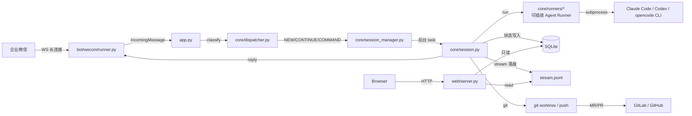
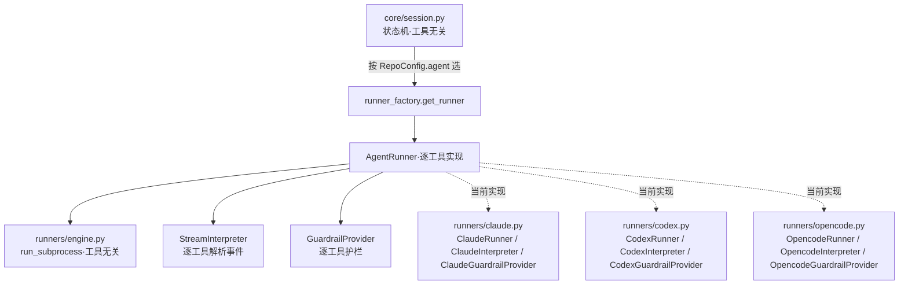

← 回到 [README](../README.md)

# 架构概览

cc-fleet 主控是一个单进程 Python 应用，把 6 个职责装在一起：聊天平台（企微 / 个人微信）接入、消息分类、session 状态机、**可插拔 Agent Runner**（当前实现 Claude Code / Codex / opencode）子进程驱动、SQLite 持久化、本地 HTTP 只读面板。

## 组件图

## 调用链

`app.py` 启动时按顺序装配：

1. `Database.connect()` —— 跑 migrations，建表
2. `WecomBotRunner` —— 起 WebSocket，注册 `on_message` 回调
3. `SessionManager(db, config, reply)` —— 持有 semaphore、`_repo_locks`、`_sessions` 字典
4. `WebServer(db, http_cfg, workspace_root).start()` —— 起 aiohttp 监听 127.0.0.1:8787

主消息流（`App._on_message`）：

1. `dispatcher.classify(msg, config, is_open_session)` 把消息归类。普通消息（无命令/引用/显式
   @repo）走 chat 还是 dev 由 `config.default_mode` 决定（默认 `chat`，先讨论后转开发）；配置了
   单个仓库时无 `@repo` 的消息自动归属唯一仓库（免 @），多仓库仍需 `@repo`/keyword 定位。
   其中 chat 模式 + 私聊（无群概念，`chatid` 空）下，无引用的普通消息先试「窗口内免引用
   自动续聊」：该用户最近一个活跃 chat 距最后一条机器人回复在 `chat.auto_continue_window_sec`
   内则直接 `CONTINUE` 续到它，否则才按 `default_mode` 开新（谓词 `App.recent_open_chat`）。
2. 按 `DispatchKind` 走分支：
   - `NEW` → `SessionManager.new_session()` 同步建 db 行 + 起后台 task（`default_mode=dev` 的普通
     消息、`@repo /dev <需求>`、不带引用的 `/dev <需求>` 直达开发都归此类）
   - `CONTINUE` → `SessionManager.continue_session()`（awaiting：唤醒已等的 task；resumable_terminal：起新 task 复活；chat 分流到 `_continue_chat`）
   - `CHAT` → `SessionManager.new_chat_session()` 起 `/chat` 独立**只读讨论**通道（`default_mode=chat`
     的普通消息也归此类；在基于最新 `<base_remote>/<default_branch>` 的共享只读 worktree
     `<repo>-worktrees/_chat` 里运行，仓库主目录始终只读不动；remote 仓库则经 ssh 读远端同名只读 worktree）
   - `HANDOFF`（引用 chat 消息的 `/dev`）→ `SessionManager.new_pipeline_from_chat()` 把被引用的 chat 讨论复用同一 claude 会话转成 pipeline，并归档原 chat
   - `COMMAND` → `commands.dispatch_command()` 同步算结果
   - `NOISE` → 直接 reply 提示
3. 后台 `_session_loop` acquire semaphore → 反复 `Session.drive()`，遇 awaiting 等 `resume_event`，遇终态退出

## 可插拔 Agent Runner（多 coding agent 支持）

cc-fleet 在架构上把「驱动一个 coding agent」做成可插拔的 runner —— 编排层工具无关，工具耦合集中在一层。目前实现了 **Claude Code** / **Codex CLI** / **opencode** 三个工具。

### 设计意图

整条交付链路（session 状态机、协议解析、模式分支 local/remote、worktree·MR）**与具体工具无关**；真正的工具耦合只集中在三处：① 子进程驱动、② 安全护栏、③ 少量配置 / 措辞。因此支持多 agent 是「补一层 runner 抽象 + 逐工具适配」，而非为每个工具复制整条流程。

### 分层（`core/runners/`）

- **`runners/base.py`**：归一接口 —— `AgentRunner`（`run(permission, protocol_text, guardrail, …)`）、`AgentPermission`（READ_ONLY / WRITE，取代 claude 专属的 plan / acceptEdits 字面量）、`AgentRunResult`、`GuardrailProvider` / `GuardrailHandle`。
- **`runners/engine.py`**：**工具无关**子进程引擎 `run_subprocess`（`start_new_session` 进程组回收、chunk 读 stream 避开 readline 64 KiB 上限）+ `StreamInterpreter` 协议（「一条事件如何抽文本 / session_id / 终态错误 / **工具生命周期**」逐工具实现）。回收不再按墙钟总时长一刀切，而是每 1s 轮询的**三档空闲监控**（`_overrun`：无工具在飞 `idle_sec` / 有工具在飞 `tool_sec` / 绝对上限 `hard_cap_sec`，见 `TimeoutPolicy`），任一触发或收到 `kill_event`（`/kill` 强杀）即 SIGTERM→SIGKILL 杀进程组。「工具在飞」由 `interpreter.tool_activity` 配对 `tool_use`/`tool_result` 判定，从而不误杀大型编译 / 测试。
- **`runners/claude.py`**：Claude 实现 —— `ClaudeRunner` / `ClaudeInterpreter` / `ClaudeGuardrailProvider`。
- **`runners/codex.py`**：Codex 实现 —— `CodexRunner`（protocol_text 前置进 prompt、`--output-last-message` 权威文本、会话 id 捕获式）/ `CodexInterpreter`（`thread.started` / `item.*` / `turn.completed|failed`；瞬态 `error` 事件不判终态）/ `CodexGuardrailProvider`（护栏走 `--sandbox`，无 settings 文件）。
- **`runners/opencode.py`**：opencode 实现 —— `OpencodeRunner`（protocol_text 前置、会话 id 捕获式、流内 `text` part 拼最终文本）/ `OpencodeInterpreter`（顶层 `sessionID`、`text`/`error` 事件、`step_start/finish` 按 `messageID` 配对当「工具在飞」信号——工具事件只在结束时发一条，运行期间流静默）/ `OpencodeGuardrailProvider`（纯 prompt 软护栏，空 handle）。
- **`runner_factory.get_runner(tool, config)`**：按 `RepoConfig.agent` 选 runner；`SUPPORTED_TOOLS` 是「已接入」的单一事实源，启动校验据此拦未接入工具。
- **配置层对称**：每个工具一个配置块（`ClaudeConfig` / `CodexConfig` / `OpencodeConfig`，都至少含 `binary`），经 `AppConfig.agent_config(tool)` 统一取用；工具无关的阶段超时 / 澄清轮次在 `PipelineConfig`。

### tool × mode 正交（加法不是乘法）

工具（claude / codex / …）与模式（local / remote）是两条正交的轴：runner / interpreter / guardrail 随**工具** ×N；模式编排（worktree 落点、SSH、算护栏「允许写的根」）随**模式** ×1，已存在且工具无关。给已支持的工具加新模式、或给已支持的模式加新工具，几乎没有新的 per-(工具 × 模式) 代码 —— 是加法不是乘法。

### 扩展一个新工具

1. 新增 `runners/<tool>.py`：实现 `AgentRunner` + `StreamInterpreter` + `GuardrailProvider`（复用 `engine.run_subprocess`）；
2. `runner_factory.get_runner` 加一个分支；
3. `config/schema.py` 加该工具的配置块（如 `CodexConfig`）；
4. 配置放行 + 实跑验证。

全是**加法**，不回头改已有 claude 代码（`get_runner` 已留好分支位）。

### 现状与 claude 耦合残留

| 工具 | 状态 | 无头 / 流 | 护栏机制 |
|---|---|---|---|
| Claude Code | ✅ 已实现 | `claude -p` / stream-json | PreToolUse hook（settings.json） |
| Codex | ✅ 已实现（local） | `codex exec` / `--json` | OS sandbox（`--sandbox`；**不拦 force-push / 敏感读**，启动 WARN） |
| opencode | ✅ 已实现（local） | `opencode run` / `--format json` | **纯 prompt 软护栏**（已拍板不上 JS 插件；写档零机械拦截，启动 WARN） |

多工具横切层已落地（session-id「分配 / 捕获」双模 + `agent_tool` 钉行 + prompt 措辞中性化，见 PR #18）；codex 的会话 id 由工具分配、首跑后从 `thread.started` 捕获，续聊走 `codex exec resume <id>`。遗留的命名耦合（`claude_session_id` 列名、events 的 `claude.<type>` 前缀、`claude/{slug}` 分支前缀）**功能上已可承载非 claude 工具**，仅名字未泛化——刻意保留，避免无谓迁移。

## SQLite schema

三张主表（见 `src/cc_fleet/storage/migrations.py`）：

### sessions

| 列 | 类型 | 说明 |
|---|---|---|
| `slug` | TEXT PK | 内部主键，初始 `req-<时间>-<random>` |
| `display_slug` | TEXT UNIQUE | plan 阶段 claude 返回的可读 slug |
| `repo` | TEXT | 仓库名（与 `config.yaml` 的 `name` 对齐） |
| `state` | TEXT | `SessionState` 枚举字面量 |
| `claude_session_id` | TEXT | Coder 的 claude `--session-id` |
| `reviewer_session_id` | TEXT | 独立 Reviewer 的 claude `--session-id`（懒生成） |
| `worktree_path` | TEXT | local 模式 worktree 绝对路径（主机本地）；remote 模式 = 壳子目录 |
| `branch` | TEXT | `claude/<slug>` |
| `default_branch` | TEXT | 目标分支（一般 `main`） |
| `initial_request` | TEXT | 用户最初输入（已剥 `[review]` 内联指令） |
| `chatid` / `userid` | TEXT | 企微会话 / 用户标识 |
| `clarify_rounds` | INT | plan ↔ awaiting 已发生轮数 |
| `plan_review_rounds` / `code_review_rounds` | INT | Reviewer 已发生轮数 |
| `review_override` | INT NULL | 单需求覆盖：NULL=跟随 repo / 1=强制开 / 0=强制关 |
| `session_kind` | TEXT | `pipeline`（默认，交付流水线）/ `chat`（`/chat` 自由对话） |
| `origin_chat_slug` | TEXT NULL | `/dev` handoff 转入时记录来源 chat 的内部 slug；NULL=普通新需求（部分唯一索引保证一条 chat 只转一次） |
| `mr_url` | TEXT | MR/PR URL |
| `last_error` / `failed_phase` | TEXT | 失败时记录，决定 follow-up resume 目标 |
| `created_at` / `updated_at` | TEXT | ISO8601 + 本地时区 |

### messages

| 列 | 类型 | 说明 |
|---|---|---|
| `id` | INT PK | 自增 |
| `session_slug` | TEXT FK | → `sessions.slug` |
| `direction` | TEXT | `in` / `out` |
| `text` | TEXT | 消息正文 |
| `quote_text` | TEXT | 用户引用的原消息 |
| `ts` | TEXT | 时间戳 |

### events

| 列 | 类型 | 说明 |
|---|---|---|
| `id` | INT PK | 自增 |
| `session_slug` | TEXT FK | → `sessions.slug` |
| `kind` | TEXT | `claude.<type>` / `reviewer.<type>` / `state` / `session_started` |
| `payload_json` | TEXT | 事件原文 JSON |
| `ts` | TEXT | 时间戳 |

## HTTP 面板 API

全部 GET、JSON、无写操作，默认 `http://127.0.0.1:8787/`。

| 路径 | 用途 |
|---|---|
| `/api/sessions[?state=open]` | session 列表；`state=open` = 工作中 + awaiting + 可恢复终态 |
| `/api/sessions/{slug}` | 单 session 详情（支持 internal slug 与 display_slug） |
| `/api/sessions/{slug}/events` | 倒序最近 200 条 claude SDK 事件（含 stream-json 原文） |
| `/api/sessions/{slug}/messages` | 全部聊天消息 |
| `/api/sessions/{slug}/plan` | 当前 session 最新 `plan.md` 原文（前端做 markdown 渲染） |
| `/api/sessions/{slug}/plan-review` | Reviewer 对 plan 的审查意见 `plan_review.md` 原文；未启用 / 未产出 → 404 / `no_plan_review` |
| `/api/sessions/{slug}/code-review` | Reviewer 对编码的审查意见 `code_review.md` 原文；未启用 / 未产出 → 404 / `no_code_review` |

### 前端筛选语义

| 组 | 状态 | 默认 |
|---|---|---|
| 工作中 | `new / planning / developing / mr_submitting / plan_reviewing / code_reviewing` | ✅ |
| 等待回复 | `awaiting_user_clarification` | ✅ |
| 已结案（可继续） | `completed / failed / timeout` | ✅ |
| 已关闭 | `cancelled` | ❌ |
| 对话 | `chatting / chat_awaiting`（`/chat` 只读对话） | ❌ |

`/chat` 只读对话会话（`session_kind='chat'`）默认隐藏（低门槛对话量大，避免刷没交付任务），勾选「对话」筛选器才显示。

前端 Messages 列头部有「Plan」按钮，点开弹出 modal，顶部 tab 在 `Plan / Plan 审查 / Code 审查` 之间切换，分别拉 `/plan`、`/plan-review`、`/code-review` 渲染 markdown；缺文件 tab 显示"暂无（未启用 Reviewer / 该阶段未产出）"（Esc 或点击遮罩关闭）。渲染器是内嵌的迷你实现（约 130 行 JS），覆盖标题/列表/代码块/行内 code/粗体/斜体/链接/引用/分隔线，保持面板"单文件、纯静态、可离线"特性。chat 会话无 plan/审查文件，「Plan」按钮对其置灰。

Messages 列的消息渲染：机器人消息（`direction=out`）走 markdown（复用上面的迷你渲染器），用户消息（`in`）保持纯文本；连续同向消息合并成一个气泡——一轮 AI 回复被 `_forward_output` 按 ~4000 字分段成多条 `out` 时，合并后按 `\n\n` 拼回再渲染，避免代码块/表格在段边界被切断。列头部还用 `session_kind` / `origin_chat_slug` 解析出 chat ↔ 转出开发任务的双向跳转链接。

## 共用连接

主进程的 `aiosqlite` 单连接被 SessionManager / Database / WebServer 共用（WAL + foreign keys）。WAL 让 web 的只读查询与主控的写并发安全；不开第二个连接是为了避免文件锁竞争。

## 时间戳口径

所有写入 DB 的时间都通过 `util/time.py:now_local_iso()` 产出（含本地时区偏移）。日志格式化器 `util/logging.py:_LocalTZFormatter` 同样输出本地时间 + 时区后缀，跨机器排查时不会丢上下文。
