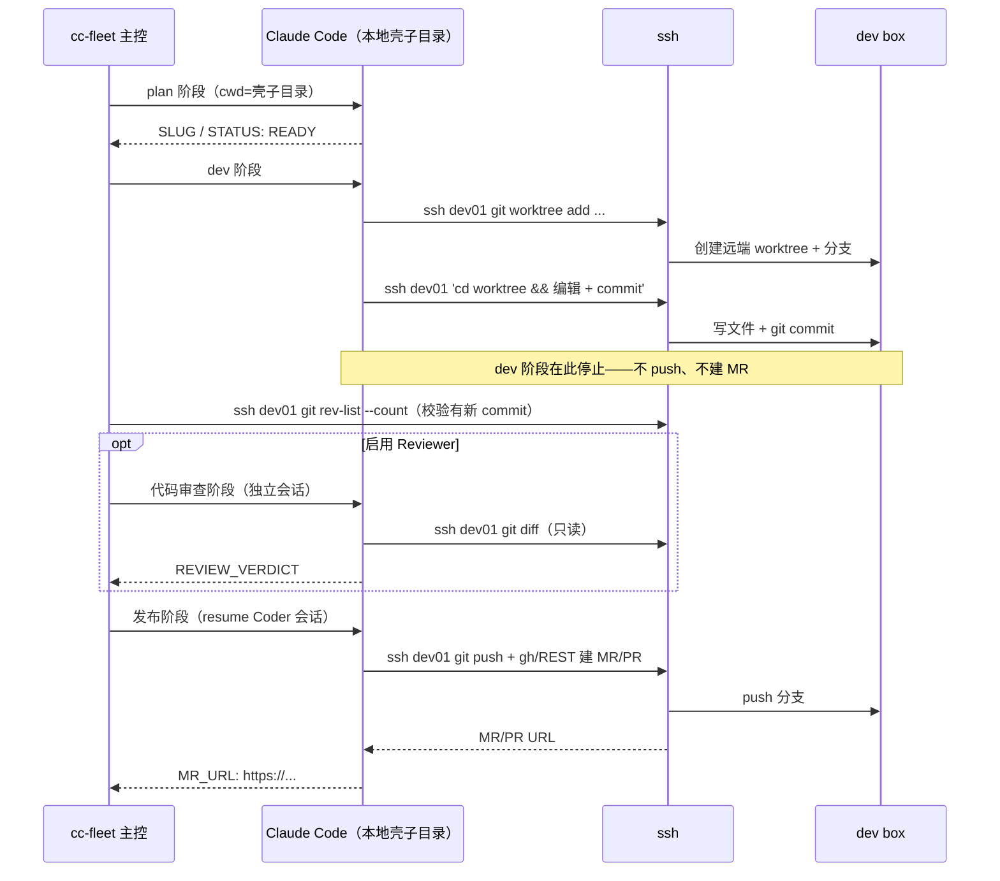

← 回到 [README](../README.md)

# 远端开发仓库（mode=remote）

部分项目代码不在本地：本地只是 claude code 的"启动壳子目录"（含 `CLAUDE.md` / 规则文件），真正代码与 worktree 都在远端 dev box，claude 通过 ssh 操作。

## 配置示例

```yaml
repos:
  - name: my-project
    aliases: [myproj]
    path: ~/my-project                          # 本地壳子目录，不需要是 git 仓库
    default_branch: main
    keywords: [my-project]
    mode: remote
    remote_ssh_alias: dev01.example.com         # ssh config 别名（已配好免密）
    remote_repo_path: /home/youruser/my-project
    remote_worktree_root: /home/youruser/my-project-worktrees
```

本地壳子目录需要有 `CLAUDE.md` 描述远端环境（约定示例：ssh 别名、远端仓库路径、worktree 规则、是否在 plan 批准后给全流程授权等）。

## 与 local 的差异

| 阶段 | local | remote |
|---|---|---|
| 创建 worktree | 主控在 `path` 下 `git worktree add` | **主控跳过**；claude 在 dev 阶段自行 ssh 到远端 `git worktree add` |
| dev 阶段 | claude 只 commit，主控负责 push + 提 MR/PR（按平台分流） | claude 在远端 **只 commit、不 push、不建 MR**（defer-push）；主控经 SSH 校验有新提交后进入审查/发布 |
| 发布（push + 建 MR/PR） | 主控本地直接提（`create_review_request`） | 独立「发布」阶段：claude resume 会话、ssh 到远端 `push` + 建 MR/PR（GitLab 走 push option，GitHub 走 `gh` / REST API），在回复末尾输出 `MR_URL: <url>` |
| MR/PR URL 来源 | 主控本地建完后返回（GitLab 取 push stderr，GitHub 取 API 响应 `html_url`） | 发布阶段 claude 远端建完后把链接写在回复的 `MR_URL:` 协议行 |

## 时序图



## PreToolUse 白名单语义

主控通过两个环境变量给 hook 注入白名单路径前缀：

- `CC_FLEET_WORKTREE`：主 worktree（local 模式 = 本地真实 worktree；remote 模式 = **本地壳子目录**）
- `CC_FLEET_EXTRA_WORKTREE_ROOTS`：额外允许的前缀清单，以 `os.pathsep` 分隔。remote 模式下主控会把 `remote_repo_path` 与 `remote_worktree_root` 注入此处，让 `ssh <host> '…'` 包裹里出现的远端绝对路径不被本地启发式误判成"工作目录外的写"

### 护栏覆盖范围对比

| 护栏项 | local | remote |
|---|---|---|
| 拦 `git push --force / -f / --force-with-lease / +ref:ref` | ✅ | ✅ 仍有效 — 包在 `ssh ... "git push --force"` 里也命中 |
| 拦敏感目录 `~/.ssh`、`~/.aws`、`/etc/passwd` 等 | ✅ | ✅ 包在 ssh 里也命中 |
| Write/Edit 路径在白名单内 | ✅ | ✅ 远端开发主要走 Bash + ssh + heredoc，Write/Edit 极少触发；触发时按白名单判定 |
| Bash 写动作 + 绝对路径在白名单外 | ✅（启发式） | ✅（启发式）远端项目根 / worktree 根纳入白名单后，命中真正越界路径才拦 |

要在远端做真正的硬隔离，需要在 dev box 上额外加 hook 机制（暂未在本版本中提供）。

## 远端 worktree 路径约定

remote 模式下，远端 worktree 路径是确定性拼接：

```
{remote_worktree_root}/{display_slug}
```

主控据此拼 SSH diff / 提交校验命令；claude 在 dev_protocol_remote.md / publish_protocol_remote.md 里看到同样的占位符被展开后的实际值，确保两端一致。

## 平台分流

remote 模式下本地无 origin 可探测，`platform: auto` 回退 `gitlab`。GitHub 仓库（含 GitHub Enterprise）必须在 repo 配置里显式写：

```yaml
platform: github
```

否则主控会按 GitLab push option 流程渲染 prompt，让 claude 在远端执行的命令对 GitHub 无效。

## 相关源码

- `src/cc_fleet/core/session.py:_do_publish_remote()` —— 发布阶段
- `src/cc_fleet/core/session.py:_render_dev_system_prompt_file()` / `_render_publish_system_prompt_file()` —— prompt 渲染
- `src/cc_fleet/core/repo.py:has_commits_ahead_remote()` —— 远端提交校验
- `src/cc_fleet/core/mr.py:extract_mr_url_from_text()` —— 从 claude 输出抽 `MR_URL:` 协议行
- `src/cc_fleet/prompts/dev_protocol_remote.md` —— dev 协议（只到 commit）
- `src/cc_fleet/prompts/publish_protocol_remote.md` —— 发布协议（push + 建 MR + 输出 MR_URL）
- `src/cc_fleet/prompts/forge_remote_gitlab.md` / `forge_remote_github.md` —— 按平台分流的发布步骤片段
