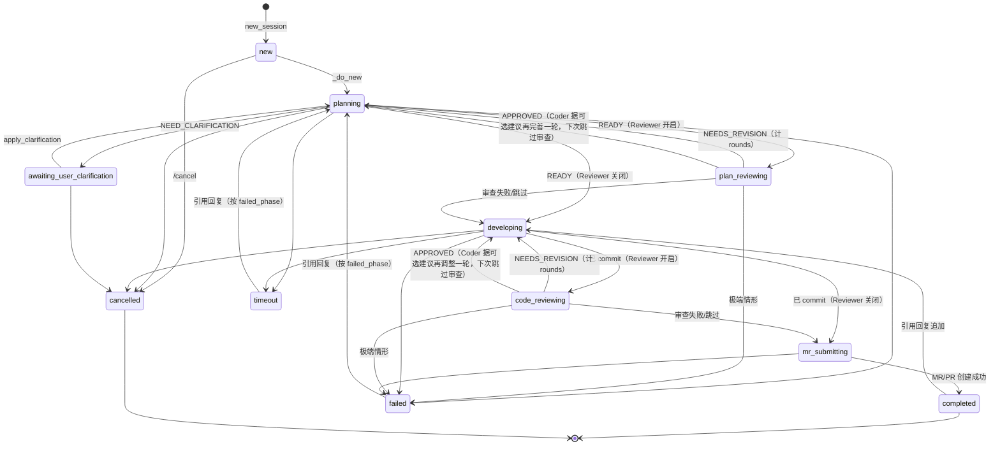

← 回到 [README](../README.md)

# 状态机详解

cc-fleet 一个 session 的完整生命周期由 `core/session.py:Session.drive()` 推动。下面是完整状态机与语义集合。

## 完整状态机

## 语义集合

四个集合，注意 `is_open` 与 `is_terminal` **不互补**：

- **WORKING_STATES**：有子进程 / 任务在跑（`new` / `planning` / `plan_reviewing` / `developing` / `code_reviewing` / `mr_submitting`）
- **AWAITING_USER_CLARIFICATION**：plan 阶段反问用户，等待澄清
- **RESUMABLE_TERMINAL_STATES**：状态机当前一轮已结，但用户引用 bot 回执回复可以唤醒进入下一轮（`failed` / `timeout` / `completed`）
- **CANCELLED**：用户已明确放弃，引用回复按"发新需求"对待

派生谓词：

- `is_working`：仅 WORKING_STATES
- `is_open`：WORKING ∪ AWAITING ∪ RESUMABLE_TERMINAL —— "能否接收用户消息继续推进"
- `is_terminal`：所有终态 —— "状态机本轮是否已结"

RESUMABLE_TERMINAL 同时满足 `is_open=True` 与 `is_terminal=True`。`cancelled` 是唯一 `is_open=False` 的终态。

## `apply_followup` 恢复目标表

引用回复唤醒已结案 session 时，按 `failed_phase` 决定 resume 回到哪个工作态：

| 当前 state | failed_phase | resume 目标 | 理由 |
|---|---|---|---|
| `completed` | — | `developing` | 在已有 worktree 上把 followup 注入为 dev 追加反馈；不重做 plan |
| `failed` / `timeout` | `new` | **拒绝** | 环境创建失败，无法续 |
| `failed` / `timeout` | `planning` | `planning` | 复用澄清路径，`pending_user_message` 注入 plan prompt |
| `failed` / `timeout` | `plan_reviewing` | `developing` | plan 已 READY 落盘，Reviewer 失败本就跳过 |
| `failed` / `timeout` | `developing` | `developing` | `pending_user_message` 注入 dev prompt |
| `failed` / `timeout` | `code_reviewing` | `developing` | 代码已 commit，回 dev 让 claude 据 followup 续改 |
| `failed` / `timeout` | `mr_submitting` (local) | `developing` | mr 阶段不调 claude，回 dev 兜底 |
| `failed` / `timeout` | `mr_submitting` (remote) | `mr_submitting` | remote 发布是 claude 调用，直接重试发布 |
| `failed` / `timeout` | NULL（老 row） | 按 `last_error` 启发兜底 | 文本含 "mr"/"push" → mr_submitting；含 "dev" → developing；含 "plan" → planning |

`cancelled` 永不触发 `apply_followup`，dispatcher 直接当作"发新需求"。

## `completed` 走 `developing` 而非 `planning` 的理由

`completed` session 的 followup 默认按"追加 dev"处理而非重做 plan，因为：

- plan 阶段是强协议模式 + 禁写文件（plan permission mode），与"解决冲突 / 微调 / 补一行"这类操作型 followup 语义互斥
- 强行走 plan 会让 claude 实际干活但解析器报 `STATUS:` 字段缺失，整个 session 转 FAILED
- 用户如需换方向重新规划，建议 `@<repo>` 开新 session

## 状态切换的副作用

每次 `_set_state(state)` 都做三件事：

1. UPDATE `sessions.state = ?` + `updated_at = now()`
2. INSERT events 表一条 `kind="state", payload={"to": state.value, ...}`
3. 后续 `drive()` 循环按新 state 选 action

进入 `failed` / `timeout` 额外写 `last_error` + `failed_phase`，供 follow-up 唤醒决策用。

## Reviewer 中间态的失败处理

`plan_reviewing` / `code_reviewing` 中 Reviewer 任一环节失败（异常 / 超时 / 退出码非 0 / 无法解析 `REVIEW_VERDICT`）一律**降级跳过**，当作没有 Reviewer 继续推进，绝不让 session 进 FAILED。这是有意设计：Reviewer 是建议而非门禁。

仅主控在审查中途崩溃等极端情形才会以这两个 phase 落 FAILED，apply_followup 会把它们映射到 `developing`。

## 相关源码

- `src/cc_fleet/core/state.py` —— 枚举与语义集合
- `src/cc_fleet/core/session.py:drive()` —— 状态机主循环
- `src/cc_fleet/core/session.py:_resume_target_state()` —— 上表的实现
- `src/cc_fleet/core/session_manager.py:_session_loop()` —— 后台 task 驱动
